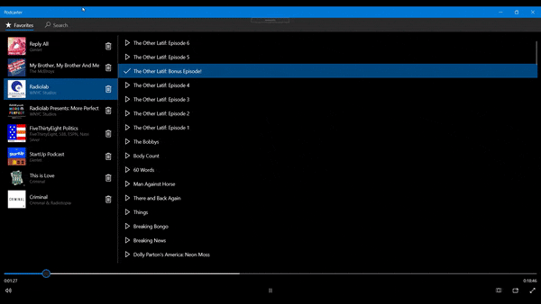

# pod-streamer

A podcast streamer for Windows 10. Built with .NET Core and UWP. Uses the [iTunes Store API](https://affiliate.itunes.apple.com/resources/documentation/itunes-store-web-service-search-api/) to search for podcasts.

